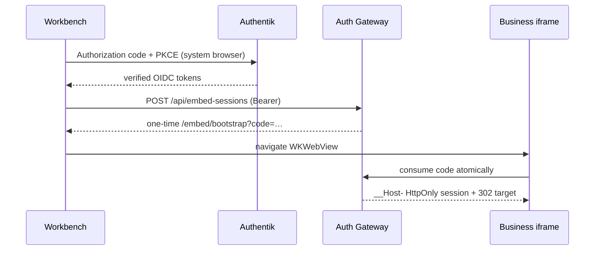

# ADR 005: Production identity and Embed Session

- Status: Accepted for V3.2
- Date: 2026-08-20

## Decision

Web keeps native Authentik dual-client SSO. macOS Desktop uses the Workbench
public client for top-level native SSO, then calls the Business Auth Gateway for
a 30-second, database-backed, one-time Embed Session. The Business WKWebView
redeems it for a host-only HttpOnly server session. Windows uses the same design
but remains release-blocked pending WebView2 verification.

PostgreSQL is authoritative for Enterprise users, Workbench sessions, Buzz
identity/device bindings, Embed sessions, Business sessions, and append-only
audit. The V3.1 Node/SQLite service remains test-only.

Access tokens never enter iframe, URL, Bridge, Nostr events, logs, or local
storage. Codes are 256-bit Base64URL; only SHA-256 hashes persist. Cookies are
`HttpOnly; Secure; SameSite=None; Partitioned; Path=/` with no `Domain`.
`GET /api/session` rotates an in-memory-only CSRF token; cookie mutations
require exact allowed Origin plus that token. Production requires a public or
enterprise-trusted CA and cannot use the development OIDC proxy.

WKWebView OIDC, Cookie copy, shared browser profiles, private Cookie APIs, and
stateless JWT tickets were rejected: they couple identity to WebView behavior
or remove atomic replay prevention.
