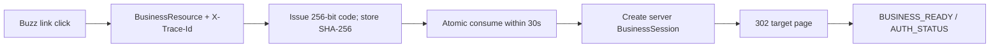

# Production Embed Session

`POST /api/embed-sessions` accepts a target and optional Buzz source context.
User, binding, Workbench session, OIDC sid, audience, and deployment are derived
from verified server context. Targets must be local `/embed/` paths.



Issuance is limited to 10 per Workbench session per minute. Consumption is one
PostgreSQL conditional `UPDATE … RETURNING` in the transaction that creates the
Business session; concurrent redemption has exactly one winner. Bootstrap uses
`Cache-Control: no-store`, `Pragma: no-cache`, and `Referrer-Policy: no-referrer`.
The supplied proxy example redacts the complete code query.

```mermaid
sequenceDiagram
  participant B as Business iframe
  participant W as Workbench
  participant G as Gateway
  B-->>W: SESSION_EXPIRED
  W->>G: verify user + binding; issue once
  G-->>W: new bootstrap URL
W->>B: bootstrap and restore last resource
  Note over W: at most one automatic recovery
```

Workbench uses authorization-code PKCE with `offline_access`. The rotating
refresh token is stored in the desktop OS keyring, never in application JSON or
an iframe. Access tokens renew two minutes before expiry and the refreshed token
is immediately revalidated by the gateway, extending the revocable Workbench
session. Business cookies last up to 24 hours and are replaced through the
one-time Embed Session flow when they expire. Refresh tokens are valid for 90
days and rotate during their final seven days, so active users normally remain
signed in across app restarts; explicit logout, user disablement, device-binding
revocation and provider-side token revocation still take effect immediately.
