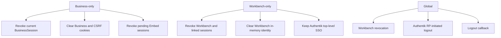

# Logout semantics

Business-only preserves Workbench OIDC, Authentik SSO, Buzz identity and channel
state. Workbench-only does not claim to exit all systems and may reuse top-level
SSO on the next login. Global additionally invokes the provider end-session
flow.

The back-channel endpoint validates logout-token signature, issuer, Business
audience/client, expiry, events claim, and the OIDC session subject. It revokes
by `sid` when present and falls back to the issuer-scoped `sub` when the provider
omits `sid`. Deployment must register and exercise that URI before marking it
PASS.

The Business Dock toolbar exposes all three user-facing scopes with distinct
labels. Workbench-only and Global logout also notify the embedded Business Host
and clear the Dock authentication state; only Global starts provider logout.
