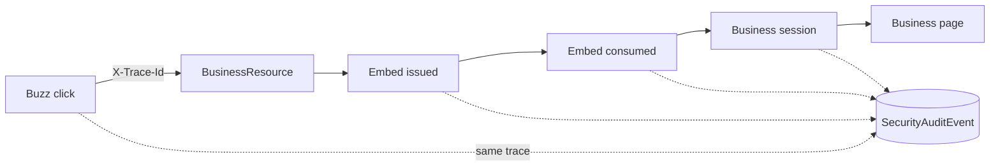

# Security audit and trace

`security_audit_events` is append-only: a PostgreSQL trigger rejects UPDATE and
DELETE. Production runtime roles receive no ability to rewrite history.

Audit covers OIDC, binding, Embed, Business session, three logout scopes,
back-channel logout, device rejection and authorization rejection. It never
stores OIDC tokens, embed codes, session tokens, cookies, client secrets or
private keys. Pubkeys are shortened. Metadata is allowlisted to optional Buzz
channel/event IDs; raw bodies and authorization headers are excluded.
